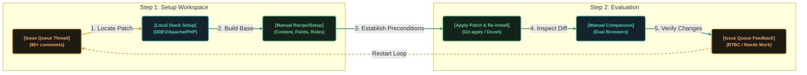
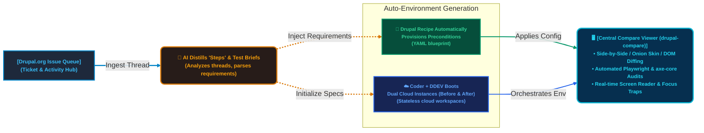

# Drupal Issue Queue Management

## Old

```mermaid
flowchart LR
    %% Define Global Styles
    classDef phaseBox fill:#1e1b15,stroke:#D69E2E,stroke-width:2px,color:#F6AD55,font-size:12px,font-weight:bold,rx:5px,ry:5px;
    classDef phaseBoxCyan fill:#13252a,stroke:#319795,stroke-width:2px,color:#4FD1C5,font-size:12px,font-weight:bold,rx:5px,ry:5px;
    classDef phaseBoxGreen fill:#14241d,stroke:#38A169,stroke-width:2px,color:#68D391,font-size:12px,font-weight:bold,rx:5px,ry:5px;

    %% Row 1 (Setup Workspace)
    Node1["[Issue Queue Thread]<br/>(80+ comments)"]:::phaseBox
    Node2["[Local Stack Setup]<br/>(DDEV/Apache/PHP)"]:::phaseBoxCyan
    Node3["[Manual Recipe/Setup]<br/>(Content, Fields, Roles)"]:::phaseBoxGreen

    %% Row 2 (Evaluation)
    Node4["[Apply Patch & Re-install]<br/>(Git apply / Drush)"]:::phaseBoxGreen
    Node5["[Manual Comparison]<br/>(Dual Browsers)"]:::phaseBoxCyan
    Node6["[Issue Queue Feedback]<br/>(RTBC / Needs Work)"]:::phaseBox

    %% Left-to-Right Top Row Flow
    Node1 -->|1. Locate Patch| Node2
    Node2 -->|2. Build Base| Node3

    %% Vertical Connecting Drop 
    Node3 -->|3. Establish Preconditions| Node4

    %% Right-to-Left Bottom Row Flow
    Node4 -->|4. Inspect Diff| Node5
    Node5 -->|5. Verify Changes| Node6
    
    %% Return Loop
    Node6 -.->|Restart Loop| Node1

    %% Layout constraints to enforce visual hierarchy 
    subgraph Row1 [Step 1: Setup Workspace]
        direction LR
        Node1
        Node2
        Node3
    end

    subgraph Row2 [Step 2: Evaluation]
        direction RL
        Node4
        Node5
        Node6
    end

    %% Styling Connections
    linkStyle 0 stroke:#D69E2E,stroke-width:2px;
    linkStyle 1 stroke:#319795,stroke-width:2px;
    linkStyle 2 stroke:#38A169,stroke-width:2px;
    linkStyle 3 stroke:#38A169,stroke-width:2px;
    linkStyle 4 stroke:#319795,stroke-width:2px;
    linkStyle 5 stroke:#D69E2E,stroke-width:2px,stroke-dasharray:5 5;
```

## New

```mermaid
flowchart LR
    %% Define Global Styles
    classDef originBox fill:#1e293b,stroke:#0284c7,stroke-width:2px,color:#38bdf8,font-size:12px,font-weight:bold;
    classDef aiBox fill:#271c19,stroke:#d97706,stroke-width:2.5px,color:#f59e0b,font-size:12px,font-weight:bold,rx:8px,ry:8px;
    classDef recipeBox fill:#064e3b,stroke:#059669,stroke-width:2px,color:#34d399,font-size:11px,font-weight:bold;
    classDef envBox fill:#172554,stroke:#2563eb,stroke-width:2px,color:#60a5fa,font-size:11px,font-weight:bold;
    classDef targetBox fill:#062f4f,stroke:#06b6d4,stroke-width:2.5px,color:#22d3ee,font-size:11.5px,font-weight:bold,rx:10px,ry:10px;

    %% Define Flow Elements
    StartNode["[Drupal.org Issue Queue]<br/>(Ticket & Activity Hub)"]:::originBox
    
    AINode["🧠 AI Distills 'Steps' & Test Briefs<br/>(Analyzes threads, parses requirements)"]:::aiBox
    
    subgraph Provisioning [Auto-Environment Generation]
        direction TB
        RecipeNode["📄 Drupal Recipe Automatically<br/>Provisions Preconditions<br/>(YAML blueprint)"]:::recipeBox
        ContainerNode["☁️ Coder + DDEV Boots<br/>Dual Cloud Instances (Before & After)<br/>(Stateless cloud workspaces)"]:::envBox
    end

    ViewerNode["🖥️ [Central Compare Viewer (drupal-compare)]<br/>• Side-by-Side / Onion Skin / DOM Diffing<br/>• Automated Playwright & axe-core Audits<br/>• Real-time Screen Reader & Focus Traps"]:::targetBox

    %% Left-to-Right Connections
    StartNode -->|Ingest Thread| AINode
    
    %% AI leading to the auto-generated environments
    AINode -->|Inject Requirements| RecipeNode
    AINode -->|Initialize Specs| ContainerNode
    
    %% Consolidating into the viewer interface on the right
    RecipeNode -->|Applies Config| ViewerNode
    ContainerNode -->|Orchestrates Env| ViewerNode

    %% Connecting styling adjustments
    linkStyle 0 stroke:#0284c7,stroke-width:2.5px;
    linkStyle 1 stroke:#d97706,stroke-width:2.5px,stroke-dasharray:3 3;
    linkStyle 2 stroke:#d97706,stroke-width:2.5px,stroke-dasharray:3 3;
    linkStyle 3 stroke:#059669,stroke-width:2px;
    linkStyle 4 stroke:#2563eb,stroke-width:2px;
```
