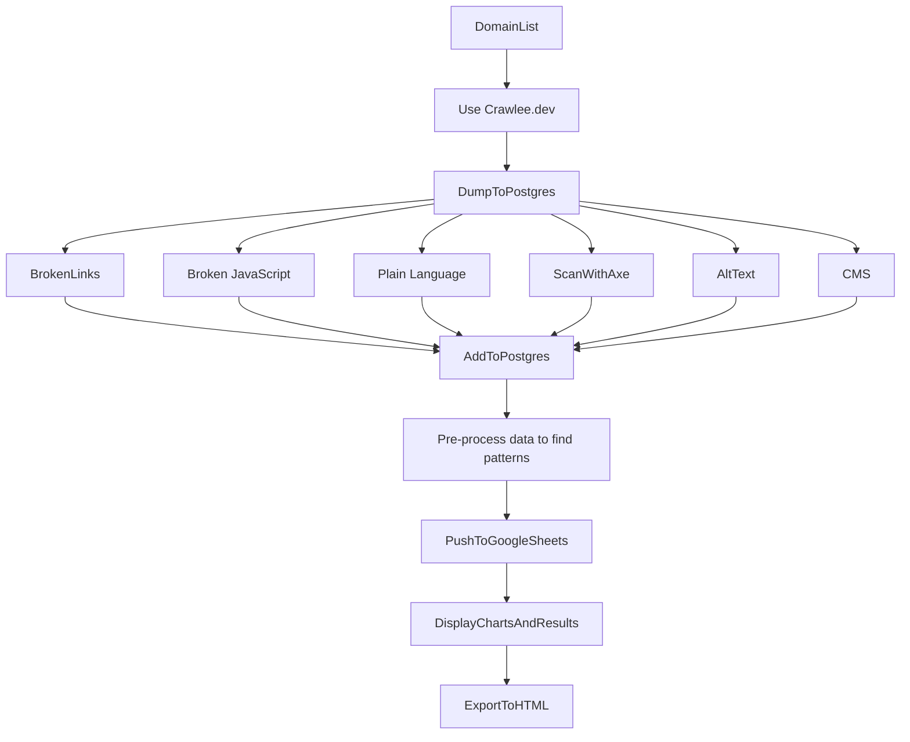
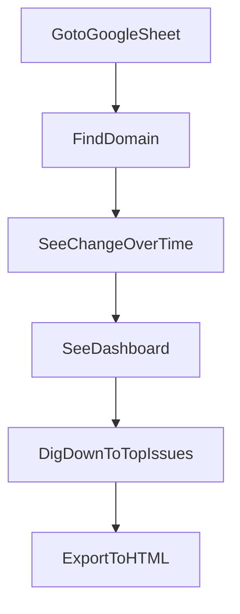
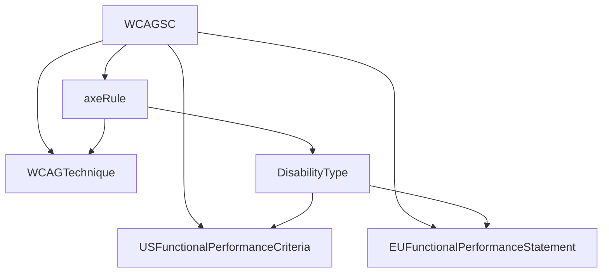

# Experimenting with big government data

## Proposed A11y Crawl

```mermaid
graph TD

      accTitle: Proposed A11y Crawl
      accDescr {
Basic workflow off elements of a gov-wide crawl.
         }

    DomainList-->Crawl4URLs;
    Crawl4URLs[Use Crawlee.dev]-->DumpToPostgres;
    DumpToPostgres-->ScanWithAxe;
    DumpToPostgres-->ScanWithPlainLanguage[Plain Language];
    DumpToPostgres-->Wappalyzer[CMS];
    DumpToPostgres-->BrokenJavaScript[Broken JavaScript];
    DumpToPostgres-->AltText;
    DumpToPostgres-->BrokenLinks;
    BrokenLinks-->AddToPostgres;
    BrokenJavaScript-->AddToPostgres;
    ScanWithPlainLanguage-->AddToPostgres;
    ScanWithAxe-->AddToPostgres;
    AltText-->AddToPostgres;
    Wappalyzer-->AddToPostgres;
    AddToPostgres-->AggregateData["Pre-process data to find patterns"];
    AggregateData-->PushToGoogleSheets;
    PushToGoogleSheets-->DisplayChartsAndResults;
    DisplayChartsAndResults-->ExportToHTML;
```

## Proposed Client Workflow

```mermaid
graph TD
   GotoGoogleSheet-->FindDomain;
   FindDomain-->SeeChangeOverTime
   SeeChangeOverTime-->SeeDashboard
   SeeDashboard-->DigDownToTopIssues;
   DigDownToTopIssues-->ExportToHTML;
```

## Related Accessibility Data

```mermaid
graph TD

      accTitle: Accessibility Data
      accDescr {
Basics for accessibility data.
         }

    WCAGSC-->axeRule;
    WCAGSC-->WCAGTechnique;
    axeRule-->WCAGTechnique;
    axeRule-->DisabilityType;
    WCAGSC-->USFunctionalPerformanceCriteria;
    WCAGSC-->EUFunctionalPerformanceStatement;
    DisabilityType-->USFunctionalPerformanceCriteria;
    DisabilityType-->EUFunctionalPerformanceStatement;
```
