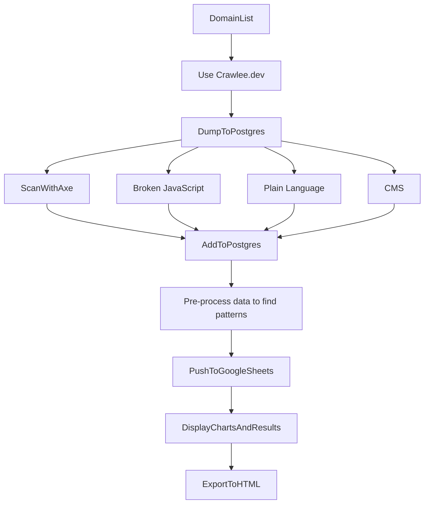
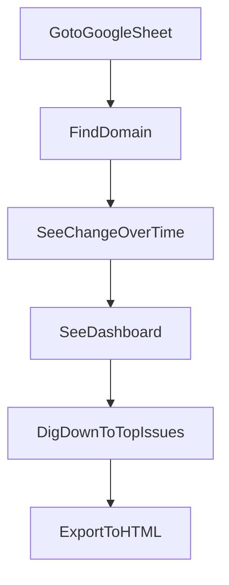

# Experimenting with big government data

## Proposed Crawl Workflow

```mermaid
graph TD
    DomainList-->Crawl4URLs;
    Crawl4URLs[Use Crawlee.dev]-->DumpToPostgres;
    DumpToPostgres-->ScanWithAxe;
    DumpToPostgres-->ScanWithPlainLanguage[Plain Language];
    DumpToPostgres--> Wappalyzer[CMS];
    DumpToPostgres--> BrokenJavaScript[Broken JavaScript];
    ScanWithAxe-->AddToPostgres;
    BrokenJavaScript-->AddToPostgres;
    ScanWithPlainLanguage-->AddToPostgres;
    Wappalyzer-->AddToPostgres;
    AddToPostgres-->AggregateData["Pre-process data to find patterns"]
    AggregateData-->PushToGoogleSheets;
    PushToGoogleSheets-->DisplayChartsAndResults;
    DisplayChartsAndResults-->ExportToHTML;
```

## Proposed Client Workflow

```mermaid
graph TD
   GotoGoogleSheet-->FindDomain;
   FindDomain-->SeeChangeOverTime
   SeeChangeOverTime-->SeeDashboard
   SeeDashboard-->DigDownToTopIssues;
   DigDownToTopIssues-->ExportToHTML;
```
