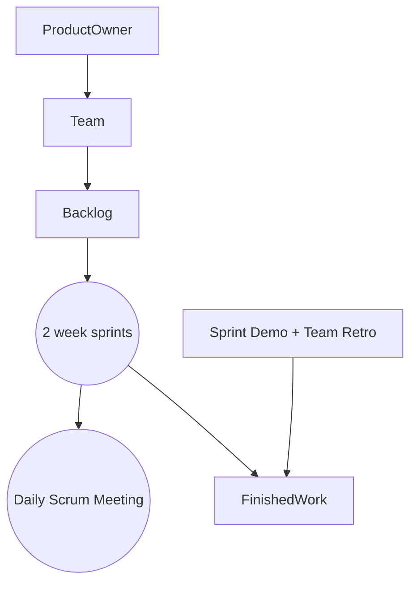

# Agile Sprint

```mermaid
graph TD

ProductOwner --> Team
Team --> Backlog
Backlog --> SprintWork
SprintWork((2 week sprints)) --> DailyScrum
DailyScrum((Daily Scrum Meeting))
SprintWork --> FinishedWork
SprintDemo[Sprint Demo + Team Retro] --> FinishedWork
```
