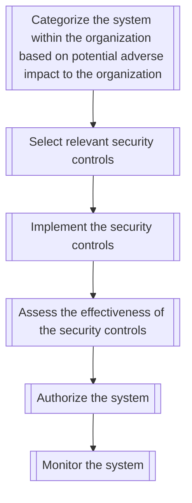

# Agile Sprint

- Categorize the system within the organization based on potential adverse impact to the organization
- Select relevant security controls
- Implement the security controls
- Assess the effectiveness of the security controls
- Authorize the system‍
- Monitor the system

