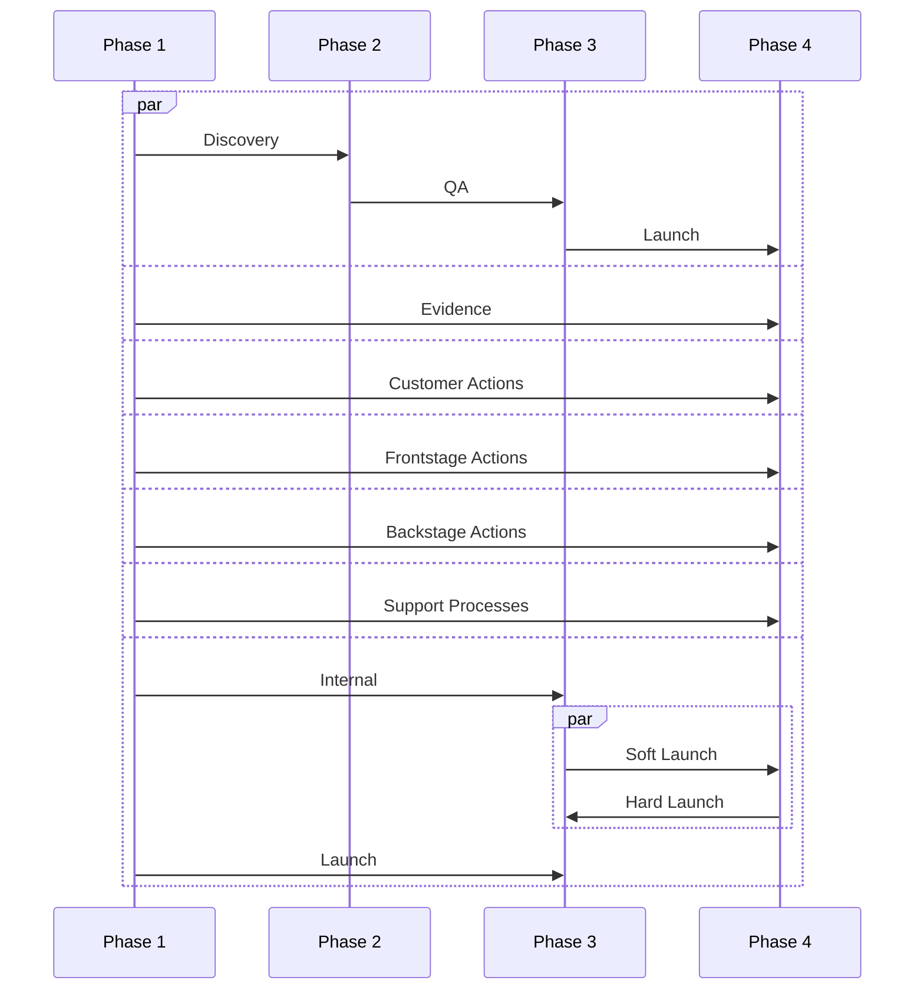
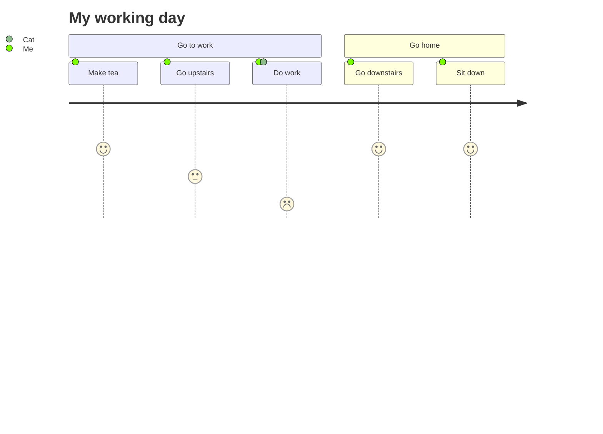
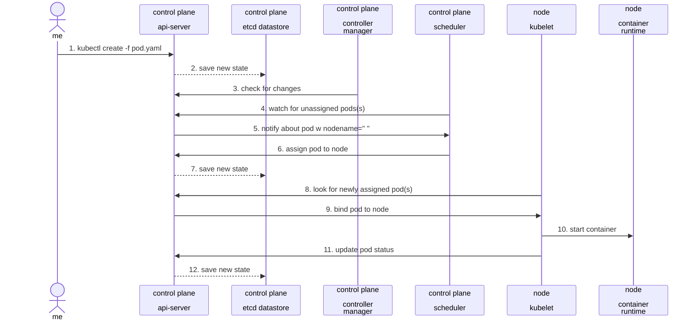

# Service Design Visualizations in Mermaid

What can we do to simplify building simple semantic diagrams.

## Service Design Blueprint 

Can we do this in Mermaid roughly based on what I see frim this [digital template](https://www.nngroup.com/articles/service-blueprinting-template/). 

## Sample Customer Journey 

Just taken from the [docs](https://mermaid.js.org/syntax/userJourney.html).

## What else

Check out the [other examples](https://mermaid.js.org/syntax/examples.html).
