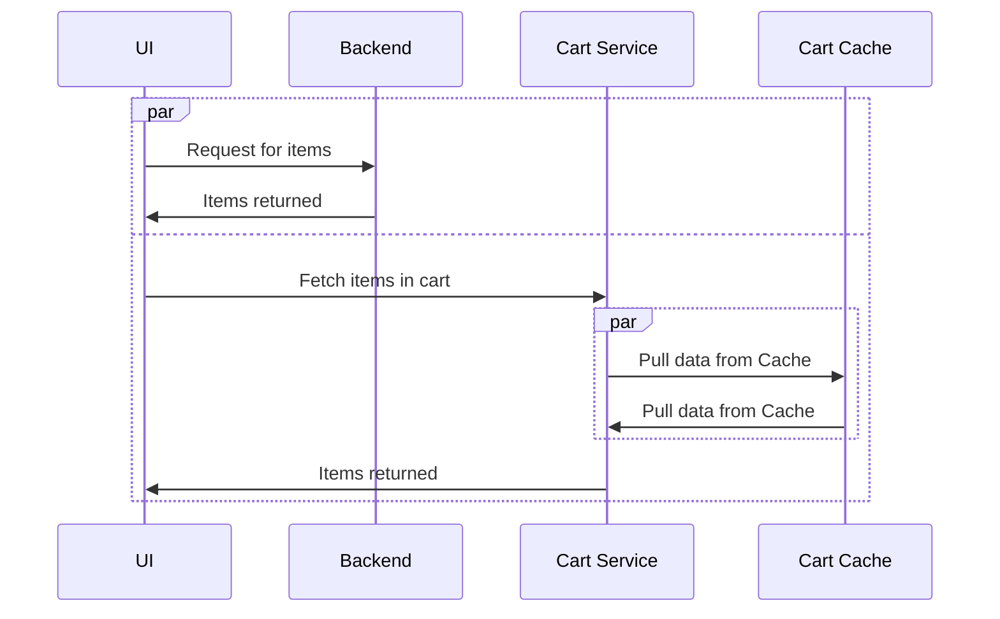
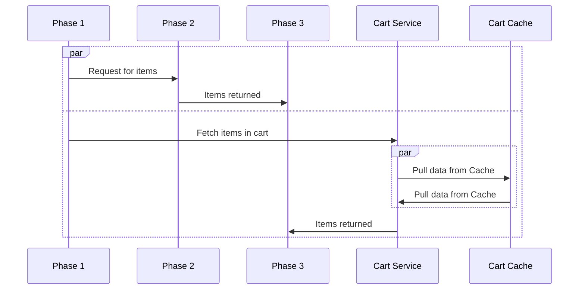

# Service Design Blueprint Idea
Can we do this in Mermaid

## Rough Workflow

```mermaid
sequenceDiagram
    par 
        UI->>Backend: Request for items
    Backend->>UI: Items returned
    and 
        UI->>Cart Service: Fetch items in cart
        par 
            Cart Service->>Cart Cache: Pull data from Cache
            Cart Cache->>Cart Service: Pull data from Cache
        end
    Cart Service->>UI: Items returned
    end
```

```mermaid
sequenceDiagram
    par 
        Phase 1->>Phase 2: Request for items
    Phase 2->>Phase 3: Items returned
    and 
         Phase 1->>Cart Service: Fetch items in cart
        par 
            Cart Service->>Cart Cache: Pull data from Cache
            Cart Cache->>Cart Service: Pull data from Cache
        end
    Cart Service->>Phase 3: Items returned
    end
```
