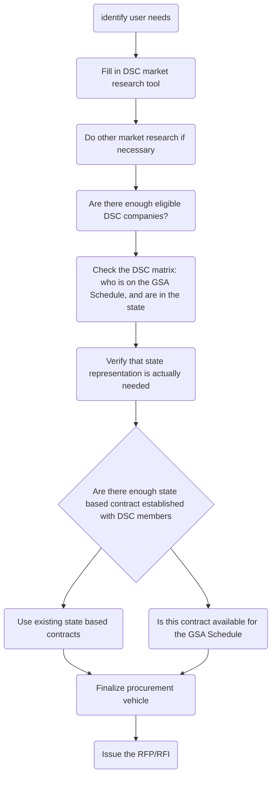

## Decision Tree

```mermaid
graph TD
    UserNeeds(identify user needs)-->DSC_MR(Fill in DSC market research tool);
    DSC_MR-->More_MR(Do other market research if necessary);

    More_MR-->CompanyPool(Are there enough eligible DSC companies?);
    CompanyPool-->DSC_Matrix(Check the DSC matrix: who is on the GSA Schedule, and are in the state);

    DSC_Matrix-->StateRepresentation(Verify that state representation is actually needed);
    StateRepresentation-->DSC_InState{Are there enough state based contract established with DSC members};

    DSC_InState-->UseStateContract(Use existing state based contracts);
    DSC_InState-->Eligible4GSA_Schedule(Is this contract available for the GSA Schedule);

    UseStateContract-->ProcurementVehicle(Finalize procurement vehicle);
    Eligible4GSA_Schedule-->ProcurementVehicle;

    ProcurementVehicle-->IssueRFP(Issue the RFP/RFI);
```
