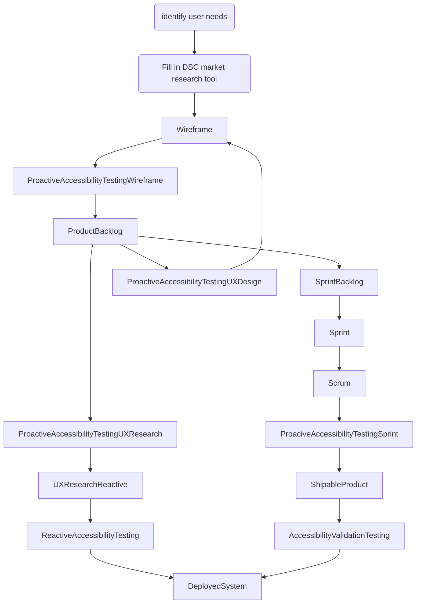

## Decision Tree

- other market research if necessary
- find good companies, how would I find companies to do this
- look at DSC matrix and see who is on schedule and if any are in the state
- in state representation (is it needed)
- is there a state based contract established with members of the DSC on it
- Check which companies are on the GSA schedule
- Eligibility determination
- Vehicle decision made - procurement vehicle
- Issue the RFP

