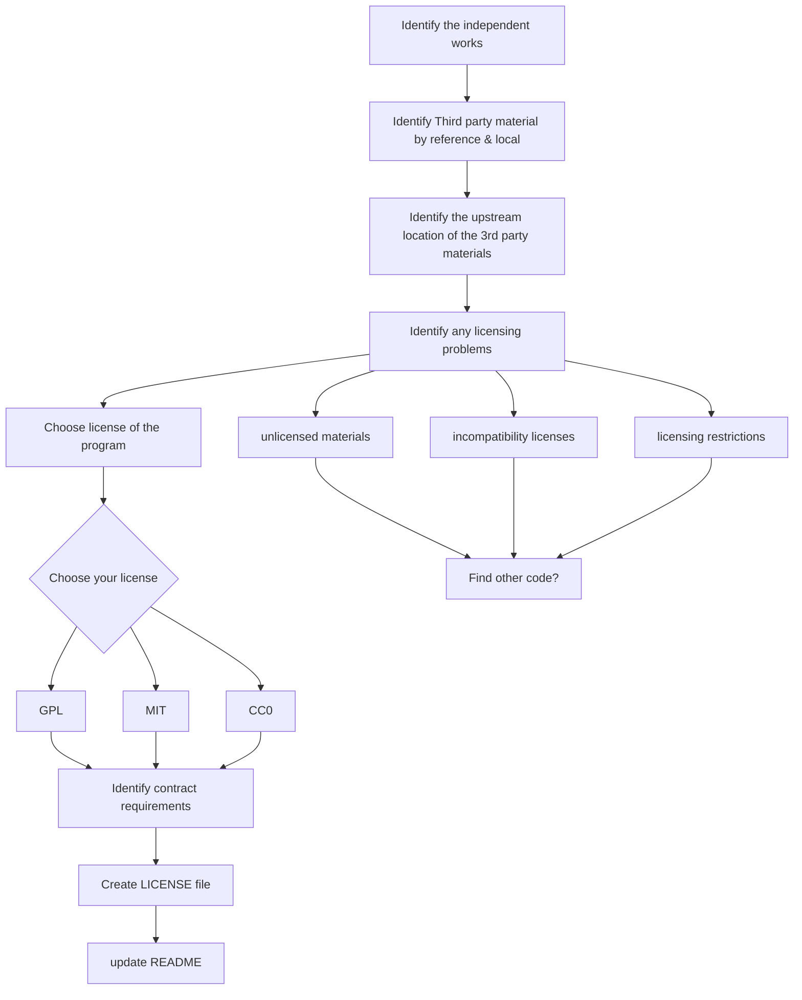

# Free Software Licensing

```mermaid
graph TD

      accTitle: Free Software
      accDescr {
 The licensing process
         }

IdentifyProject[Identify the independent works] --> Identify3rdParty
Identify3rdParty[Identify Third party material by reference & local] --> UpstreamLocation
UpstreamLocation[Identify the upstream location of the 3rd party materials] --> Problems
Problems[Identify any licensing problems] --> NoProblems
NoProblems[Choose license of the program] --> LicenseChoice
Problems --> unlicensed[unlicensed materials]
Problems --> incompatability[incompatibility licenses]
Problems --> restrictions[licensing restrictions]
unlicensed --> stop[Find other code?]
incompatability --> stop[Find other code?]
restrictions --> stop[Find other code?]
LicenseChoice{Choose your license}  --> GPL
LicenseChoice --> MIT
LicenseChoice --> CC0
GPL--> contractRequirements
MIT--> contractRequirements
CC0--> contractRequirements
contractRequirements[Identify contract requirements] --> CreatLicense
CreatLicense[Create LICENSE file] --> UpdateReadme
UpdateReadme[update README]
```
