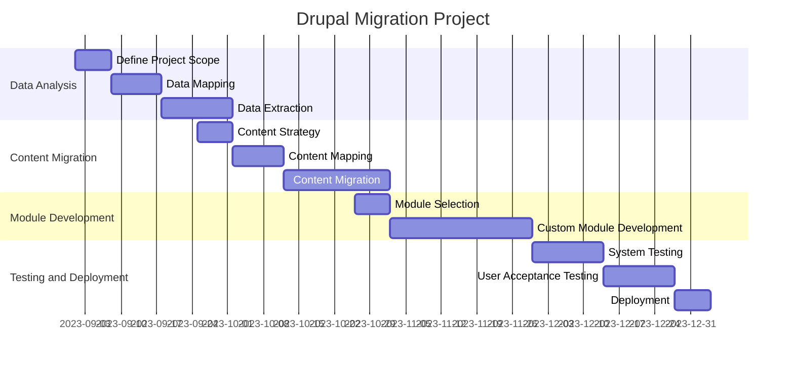
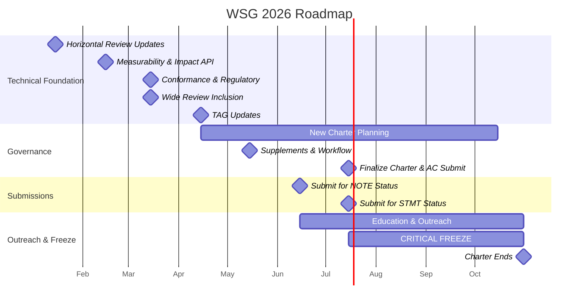

Testing Gantt Charts

```mermaid
gantt
    title Drupal Migration Project
    dateFormat  YYYY-MM-DD
    section Data Analysis
    Define Project Scope       :2023-09-01, 7d
    Data Mapping               :2023-09-08, 10d
    Data Extraction            :2023-09-18, 14d

    section Content Migration
    Content Strategy           :2023-09-25, 7d
    Content Mapping            :2023-10-02, 10d
    Content Migration          :2023-10-12, 21d

    section Module Development
    Module Selection           :2023-10-26, 7d
    Custom Module Development  :2023-11-02, 28d

    section Testing and Deployment
    System Testing             :2023-11-30, 14d
    User Acceptance Testing    :2023-12-14, 14d
    Deployment                 :2023-12-28, 7d
```

```mermaid
gantt
    title WSG 2026 Roadmap
    dateFormat  YYYY-MM-DD
    axisFormat  %b
    
    section Technical Foundation
    Horizontal Review Updates     :milestone, 2026-01-15, 0d
    Measurability & Impact API    :milestone, 2026-02-15, 0d
    Conformance & Regulatory      :milestone, 2026-03-15, 0d
    Wide Review Inclusion         :milestone, 2026-03-15, 0d
    TAG Updates                   :milestone, 2026-04-15, 0d

    section Governance
    New Charter Planning          :2026-04-15, 2026-10-15
    Supplements & Workflow        :milestone, 2026-05-15, 0d
    Finalize Charter & AC Submit  :milestone, 2026-07-15, 0d

    section Submissions
    Submit for NOTE Status        :milestone, 2026-06-15, 0d
    Submit for STMT Status        :milestone, 2026-07-15, 0d

    section Outreach & Freeze
    Education & Outreach          :2026-06-15, 2026-10-31
    CRITICAL FREEZE: NO EDITS     :crit, 2026-07-15, 2026-10-31
    Charter Ends                  :milestone, 2026-10-31, 0d
```
