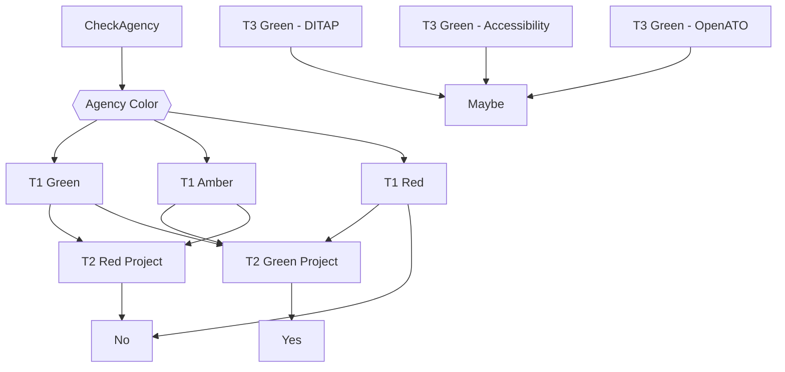
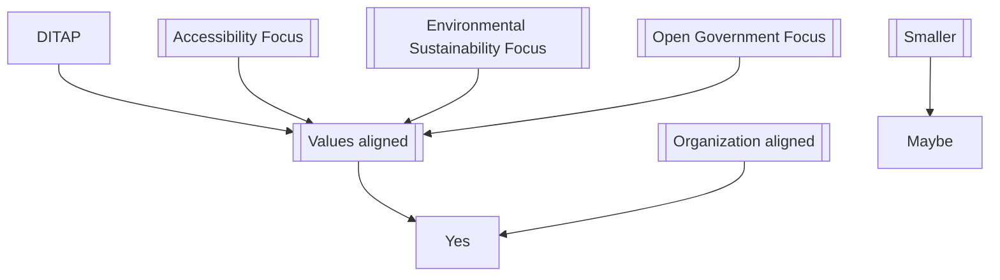

# Impact Direction for Sales

## Agency Workflow

```mermaid
graph TD
    CheckAgency-->IsGreen{{Agency Color}};
    IsGreen-->GreenAgency[T1 Green];
    IsGreen-->AmberAgency[T1 Amber];
    IsGreen--> RedAgency[T1 Red];
    RedAgency-->GreenProject[T2 Green Project];
    RedAgency-->No;
    AmberAgency-->GreenProject;
    GreenAgency-->RedProject[T2 Red Project];
    AmberAgency-->RedProject;
    GreenAgency-->GreenProject;
    GreenGoalDITAP[T3 Green - DITAP]-->Maybe;
    GreenGoalA11y[T3 Green - Accessibility]-->Maybe;
    GreenGoalATO[T3 Green - OpenATO]-->Maybe;
    RedProject-->No;
    GreenProject-->Yes;
```

## Values workflow

```mermaid
graph TD
   DITAP-->Tier1;
   Accessibility[[Accessibility Focus]]-->Tier1;
   Sustainability[[Environmental Sustainability Focus]]-->Tier1;
   Open[[Open Government Focus]]-->Tier1;
   Tier1[[Values aligned]]-->Yes;
   Tier2[[Organization aligned]]-->Yes
   Tier3[[Smaller]]-->Maybe
```
