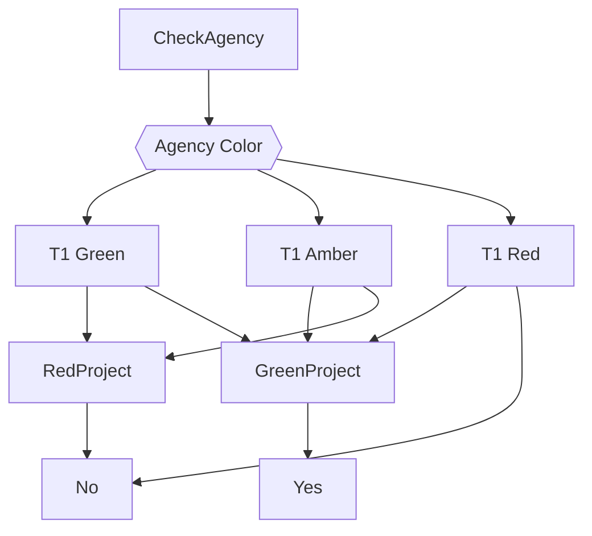
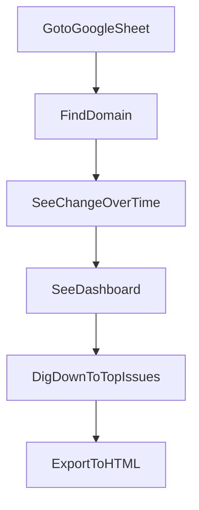

# Impact Direction for Sales

## Proposed Crawl Workflow

```mermaid
graph TD
    CheckAgency-->IsGreen{{Agency Color}};
    IsGreen-->GreenAgency[T1 Green];
    IsGreen-->AmberAgency[T1 Amber];
    IsGreen--> RedAgency[T1 Red];
    RedAgency-->GreenProject;
    RedAgency-->No;
    AmberAgency-->GreenProject;
    GreenAgency-->RedProject;
    AmberAgency-->RedProject;
    GreenAgency-->GreenProject;
    RedProject-->No;
    GreenProject-->Yes;
```

## Ignore

```mermaid
graph TD
   GotoGoogleSheet-->FindDomain;
   FindDomain-->SeeChangeOverTime
   SeeChangeOverTime-->SeeDashboard
   SeeDashboard-->DigDownToTopIssues;
   DigDownToTopIssues-->ExportToHTML;
```
