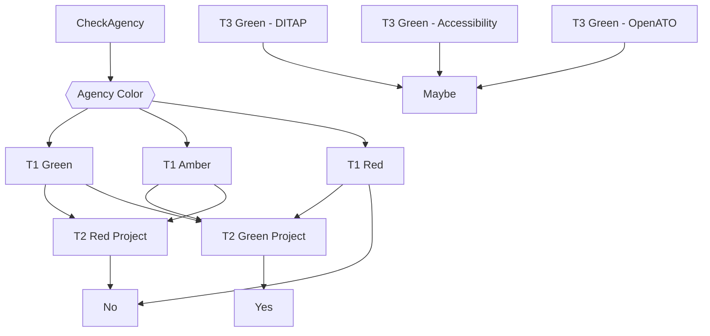
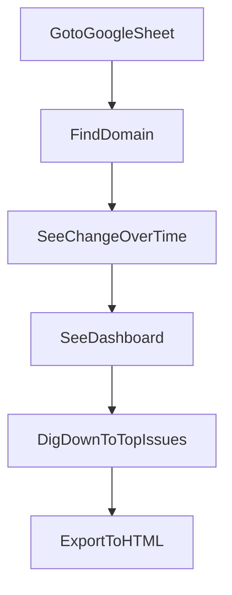

# Impact Direction for Sales

## Sales Workflow

```mermaid
graph TD
    CheckAgency-->IsGreen{{Agency Color}};
    IsGreen-->GreenAgency[T1 Green];
    IsGreen-->AmberAgency[T1 Amber];
    IsGreen--> RedAgency[T1 Red];
    RedAgency-->GreenProject[T2 Green Project];
    RedAgency-->No;
    AmberAgency-->GreenProject;
    GreenAgency-->RedProject[T2 Red Project];
    AmberAgency-->RedProject;
    GreenAgency-->GreenProject;
    GreenGoalDITAP[T3 Green - DITAP]-->Maybe;
    GreenGoalA11y[T3 Green - Accessibility]-->Maybe;
    GreenGoalATO[T3 Green - OpenATO]-->Maybe;
    RedProject-->No;
    GreenProject-->Yes;
```

## Ignore

```mermaid
graph TD
   GotoGoogleSheet-->FindDomain;
   FindDomain-->SeeChangeOverTime
   SeeChangeOverTime-->SeeDashboard
   SeeDashboard-->DigDownToTopIssues;
   DigDownToTopIssues-->ExportToHTML;
```
