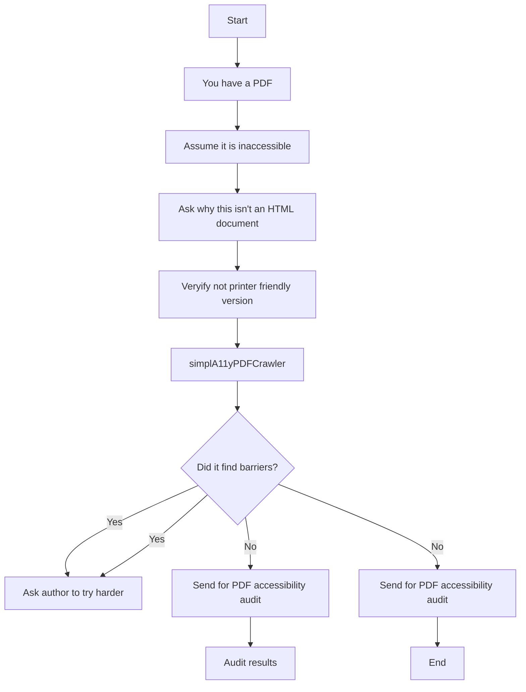

## Accessible PDF Evaluation

```mermaid
graph TD
    Start-->YouHaveAPDF[You have a PDF];
    YouHaveAPDF-->AssumeInaccessible[Assume it is inaccessible];
    AssumeInaccessible-->AskWhyNotHTNML[Ask why this isn't an HTML document];
    AskWhyNotHTNML-->VerifyNotPriterFriendlyVersion[Veryify not printer friendly version];
    VerifyNotPriterFriendlyVersion-->simplA11yPDFCrawler;
    simplA11yPDFCrawler-->DidItFindBarriers{Did it find barriers?};
    DidItFindBarriers --> |Yes| AskAuthorToTryHarder[Ask author to try harder];
    DidItFindBarriers --> |No| SendForPDFAudit[Send for PDF accessibility audit]
    SendForPDFAudit --> AuditResults[Audit results]
    DidItFindBarriers --> |Yes| AskAuthorToTryHarder[Ask author to try harder];
    DidItFindBarriers --> |No| PostToSite[Send for PDF accessibility audit]
    PostToSite-->End;
```
