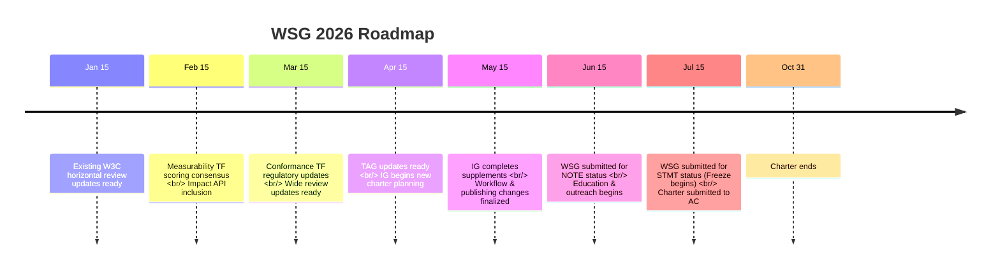

Timelines

```mermaid
timeline
    title WSG 2026 Roadmap
    Jan 15 : Existing W3C horizontal review updates ready
    Feb 15 : Measurability TF scoring consensus <br/> Impact API inclusion
    Mar 15 : Conformance TF regulatory updates <br/> Wide review updates ready
    Apr 15 : TAG updates ready <br/> IG begins new charter planning
    May 15 : IG completes supplements <br/> Workflow & publishing changes finalized
    Jun 15 : WSG submitted for NOTE status <br/> Education & outreach begins
    Jul 15 : WSG submitted for STMT status (Freeze begins) <br/> Charter submitted to AC
    Oct 31 : Charter ends
```
