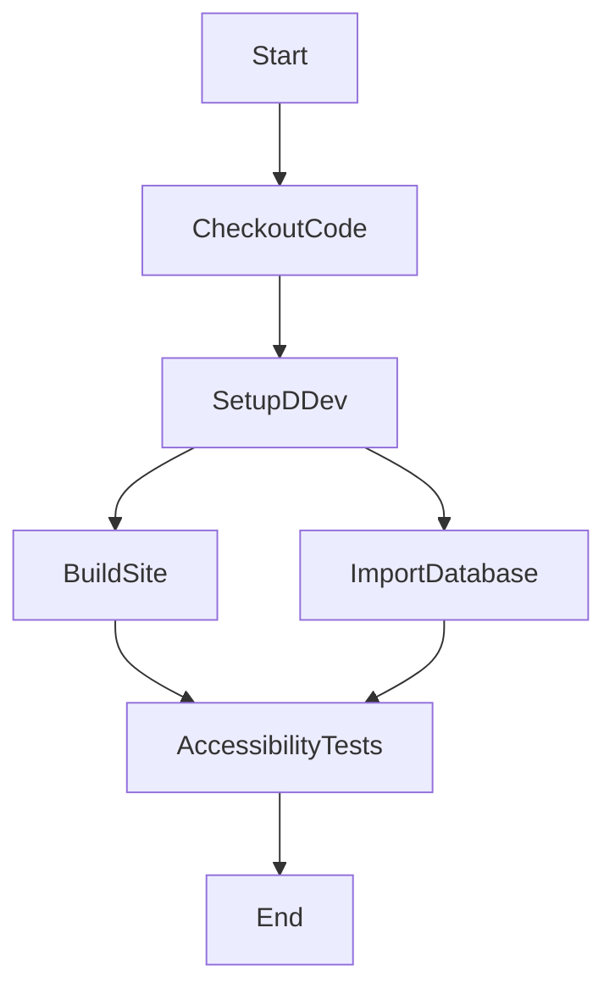

# graph
Simple accessibility workflow

## Workflow 1

```mermaid
graph TD
    Start-->CheckoutCode;
    CheckoutCode-->SetupDDev;
    SetupDDev-->BuildSite;
    SetupDDev-->ImportDatabase;
    BuildSite-->AccessibilityTests;
    ImportDatabase-->AccessibilityTests;
    AccessibilityTests-->End;
```
