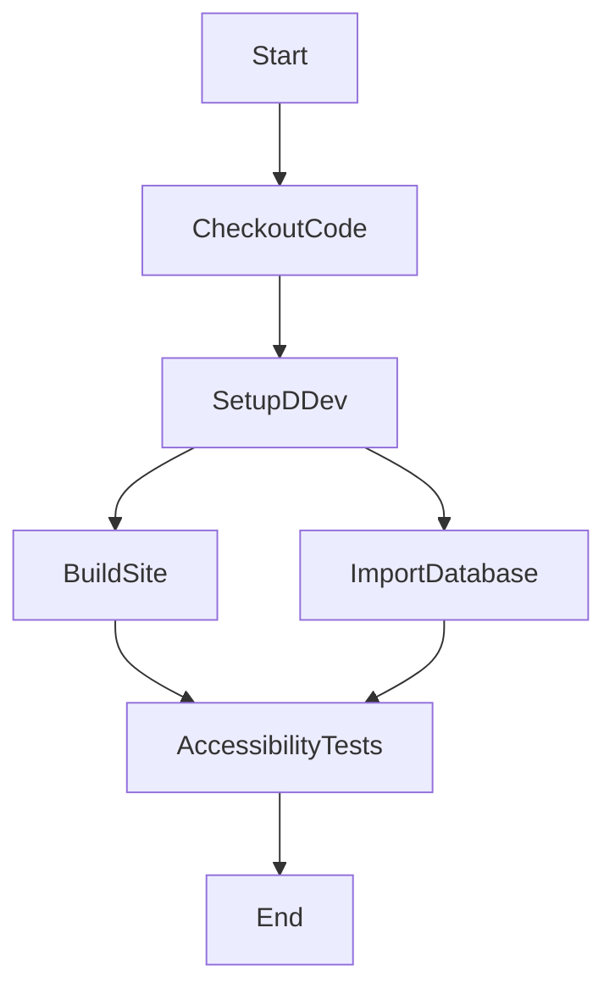
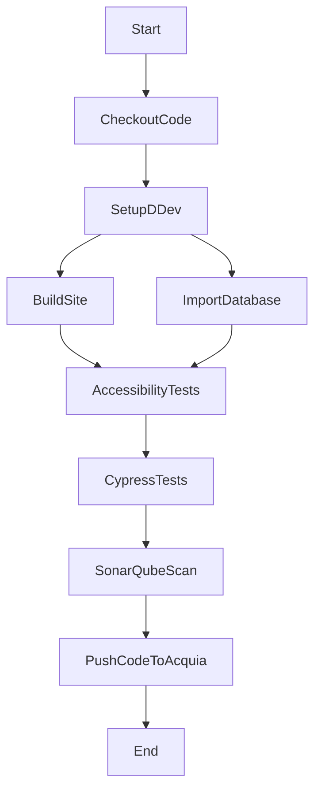

# graph
Simple accessibility workflow


## Workflow 1




## Workflow 2




## Workflow 3

```mermaid
graph TD
    Start-->CheckoutCode;
    CheckoutCode-->SetupDDev{Setup DDev};
    SetupDDev-->BuildSite;
    SetupDDev-->ImportDatabase;
    BuildSite-->AccessibilityTests;
    ImportDatabase-->AccessibilityTests;
    AccessibilityTests > |NoErrors{No Errors}| AccessibilityTestsOk[OK]
    AccessibilityTestsOk-->CypressTests;
    CypressTests-->SonarQubeScan;
    SonarQubeScan-->PushCodeToAcquia;
    PushCodeToAcquia-->End;
```

