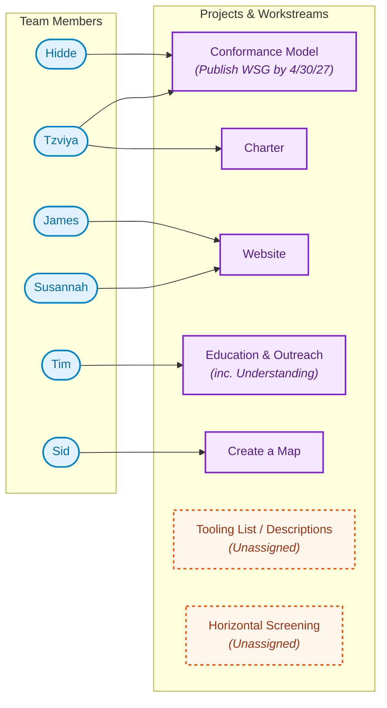

# Peopole and Tasks

```mermaid
flowchart LR
    %% Team Members
    subgraph People ["Team Members"]
        direction TB
        Tzviya(["Tzviya"])
        Hidde(["Hidde"])
        Susannah(["Susannah"])
        James(["James"])
        Tim(["Tim"])
        Sid(["Sid"])
    end

    %% Projects
    subgraph Projects ["Projects & Workstreams"]
        direction TB
        P_WSG["Conformance Model<br/><i>(Publish WSG by 4/30/27)</i>"]
        P_Charter["Charter"]
        P_Website["Website"]
        P_Edu["Education & Outreach<br/><i>(inc. Understanding)</i>"]
        P_Map["Create a Map"]
        P_Tooling["Tooling List / Descriptions<br/><i>(Unassigned)</i>"]
        P_Screening["Horizontal Screening<br/><i>(Unassigned)</i>"]
    end

    %% Relationships
    Tzviya --> P_WSG
    Hidde --> P_WSG
    Tzviya --> P_Charter
    Susannah --> P_Website
    James --> P_Website
    Tim --> P_Edu
    Sid --> P_Map

    %% Styling
    classDef person fill:#e0f2fe,stroke:#0284c7,stroke-width:2px,color:#0369a1;
    classDef assigned fill:#f3e8ff,stroke:#7e22ce,stroke-width:2px,color:#581c87;
    classDef unassigned fill:#fff7ed,stroke:#ea580c,stroke-width:2px,stroke-dasharray: 4 4,color:#9a3412;

    class Tzviya,Hidde,Susannah,James,Tim,Sid person;
    class P_WSG,P_Charter,P_Website,P_Edu,P_Map assigned;
    class P_Tooling,P_Screening unassigned;
```
